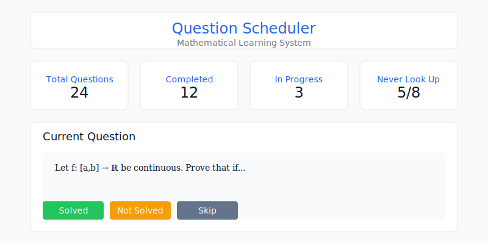
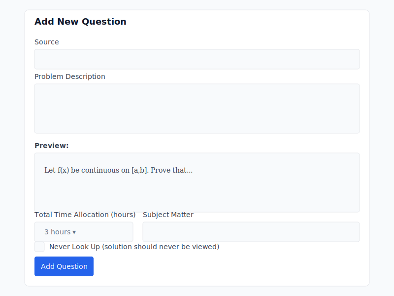

# Question Scheduler: A Mathematical Learning System

[](https://opensource.org/licenses/MIT)
[](https://nodejs.org)
[](https://expressjs.com)
[](https://katex.org)

> A systematic approach to mathematical learning that balances thorough understanding with steady progress.

## Table of Contents

1. [Quick Start](#quick-start)
2. [Overview](#overview)
3. [Screenshots and Interface](#screenshots)
   - [Main Interface](#main-interface)
   - [Add Question Interface](#add-question-interface)
   - [Interface Components](#interface-components)
4. [Features](#features)
   - [Core Features](#core-features)
   - [Technical Features](#technical-features)
5. [Installation](#installation)
   - [Prerequisites](#prerequisites)
   - [Setup Steps](#setup-steps)
   - [Configuration](#configuration)
6. [User Guide](#user-guide)
   - [Getting Started](#getting-started)
   - [Adding Questions](#adding-questions)
   - [Working with Questions](#working-with-questions)
   - [LaTeX Support](#latex-support)
   - [Question States](#question-states)
   - [Time Management](#time-management)
7. [Learning Methodology](#learning-methodology)
   - [Regular Problems](#regular-problems)
   - [Advanced Problems](#advanced-problems)
   - [Best Practices](#best-practices)
8. [Technical Documentation](#technical-documentation)
   - [Project Structure](#project-structure)
   - [API Reference](#api-reference)
   - [Database Schema](#database-schema)
   - [Error Handling](#error-handling)
9. [Troubleshooting](#troubleshooting)
   - [Common Issues](#common-issues)
   - [FAQ](#faq)
10. [Contributing](#contributing)
    - [Development Setup](#development-setup)
    - [Coding Standards](#coding-standards)
    - [Pull Request Process](#pull-request-process)
11. [Future Roadmap](#future-roadmap)
12. [License](#license)
13. [Acknowledgments](#acknowledgments)

## Quick Start
```bash
git clone https://github.com/andre-meneses/question-scheduler.git
cd question-scheduler
npm install
npm start
```

Access the application at `http://localhost:3000`

## Overview

The Question Scheduler is a web-based application designed to help users learn mathematics through a structured, methodical approach. It maintains a set of mathematical problems and implements a specific learning methodology that balances thorough understanding with steady progress.

Key principles:
- Random selection from available problems
- Time-boxed learning sessions
- Structured practice intervals
- Progress tracking and analytics
- Support for both regular and advanced problem-solving approaches

For a detailed explanation of the learning philosophy and methodology behind this system, see [SPECIFICATION.md](SPECIFICATION.md).

## Screenshots

### Main Interface

*The main interface shows your current statistics, active question, and timer. The interface is organized into three main sections:*

#### Interface Components
1. **Statistics Dashboard**
   - Total Questions Counter
   - Completion Statistics
   - Progress Indicators
   - Never Look Up Success Rate

2. **Navigation Tabs**
   - Current Question View
   - Add Question Interface
   - Question List Overview

3. **Active Question Area**
   - Problem Display with LaTeX Rendering
   - Timer with Visual Feedback
   - Action Buttons
     - Solved
     - Not Solved
     - Skip

### Add Question Interface

*The add question interface provides:*

#### Input Components
1. **Problem Input**
   - LaTeX-enabled text area
   - Real-time preview
   - Syntax highlighting

2. **Metadata Fields**
   - Source reference
   - Subject classification
   - Time allocation selector
   - Never Look Up toggle

3. **Preview Panel**
   - Rendered LaTeX preview
   - Mobile view preview
   - Print layout preview


## Features

### Core Features

#### Question Management
- Add, edit, and delete mathematical questions
- LaTeX support for mathematical notation
- Real-time preview of formatted questions
- Source and subject categorization
- "Never look up" option for advanced problems

#### Practice Sessions
- Structured time management
- Random question selection from available set
- Progressive difficulty scaling
- Session history tracking

#### Progress Tracking
- Comprehensive statistics
- Attempt history
- Time management analytics
- Success rate monitoring

### Technical Features
- Full LaTeX rendering (KaTeX and MathJax)
- Backend persistence with Express
- Real-time preview for LaTeX input
- Session-based timer management
- Responsive design
- Local storage backup
- REST API for data management

## Installation

### Prerequisites
- Node.js ≥ 14.0.0
- npm or yarn
- Modern web browser (Chrome, Firefox, Safari, or Edge)

### Setup Steps

1. Clone the repository:
```bash
git clone https://github.com/andre-meneses/question-scheduler.git
cd question-scheduler
```

2. Install dependencies:
```bash
npm install
```

3. Start the server:
```bash
npm start
```

4. Access the application at `http://localhost:3000`

### Configuration

Environment variables (create a `.env` file):
```env
PORT=3000
NODE_ENV=development
STORAGE_PATH=./questions.json
```

## User Guide

### Getting Started

1. **Initial Setup**
   - Launch the application
   - Navigate to the "Add Question" tab
   - Add your first set of problems

2. **System Organization**
   - Problems are organized by subject and source
   - Each problem has allocated time and attempt limits
   - Problems can be marked as "never look up" for independent mastery

### Adding Questions

1. Click the "Add Question" tab
2. Fill in:
   - Source (e.g., "Rudin Chapter 3")
   - Problem description (supports LaTeX)
   - Time allocation (3, 6, 9, or 12 hours)
   - Subject matter
   - Never look up option (for challenging problems)

### LaTeX Support

Use standard LaTeX notation:
- Inline math: `$...$`
- Display math: `$$...$$`

Example:
```latex
Let $f: [a,b] \to \mathbb{R}$ be continuous. Prove that if
$$\int_a^b f(x) dx = 0$$
and $f(x) \geq 0$ for all $x \in [a,b]$, then $f(x) = 0$ for all $x \in [a,b]$.
```

### Working with Questions

1. Click "Get Next Question" to start a session
2. The system will:
   - Randomly select an available question
   - Start a timed session
   - Track progress
3. After attempting:
   - Click "Solved" if completed independently
   - Click "Not Solved" if solution was viewed
   - Click "Skip" to attempt later

### Question States
- **New**: Not yet attempted
- **In Progress**: Currently being worked on
- **Attempted**: Worked on but not completed
- **Completed**: Successfully solved or time exhausted

## Learning Methodology

### Regular Problems (2/3 of total set)
- Initial 30-minute attempt limit
- Solution consultation allowed after time limit
- Focus on understanding and learning from solutions

### Advanced Problems (1/3 of total set)
- Longer allocated thinking time (3-12 hours total)
- Progressive attempt intervals:
  1. First attempt: 15 minutes
  2. Second attempt: 30 minutes
  3. Third attempt: 1 hour
- Optional "never look up" designation

## Technical Documentation

### Project Structure
```
question-scheduler/
├── public/
│   ├── index.html
│   ├── styles.css
│   ├── app.js
│   └── scheduler.js
├── server.js
├── fileOperations.js
├── questions.json
├── SPECIFICATION.md
├── README.md
├── .gitignore
└── package.json
```

### API Reference

#### Endpoints
```typescript
GET /api/questions
POST /api/questions
PUT /api/questions/:id
DELETE /api/questions/:id
```

#### Question Schema
```typescript
interface Question {
  id: number;
  source: string;
  problem: string;
  totalTime: number;
  remainingTime: number;
  subject: string;
  status: 'new' | 'in-progress' | 'attempted' | 'completed';
  attempts: Attempt[];
  timeSpent: number;
  solvedIndependently: boolean | null;
  neverLookUp: boolean;
  created: string;
  lastAttempt: string | null;
}

interface Attempt {
  date: string;
  timeSpent: number;
  result: 'solved' | 'not-solved' | 'skipped';
}
```

## Troubleshooting

### Common Issues

1. **LaTeX Rendering**
   - Ensure proper delimiter usage
   - Check for matching brackets
   - Verify symbol compatibility

2. **Time Management**
   - Browser tab focus issues
   - Session persistence
   - Timer synchronization

3. **Data Management**
   - Local storage limits
   - Data backup considerations
   - Import/export functionality

### FAQ

1. **Q: How are questions selected?**
   A: Questions are randomly selected from the set of available problems, considering time constraints and attempt history.

2. **Q: What happens to incomplete questions?**
   A: They remain in the available set with their remaining time allocation, unless marked as completed or time has expired.

3. **Q: Can I modify time allocations?**
   A: Yes, through the question edit interface.

## Contributing

1. Fork the repository
2. Create your feature branch (`git checkout -b feature/AmazingFeature`)
3. Commit your changes (`git commit -m 'Add some AmazingFeature'`)
4. Push to the branch (`git push origin feature/AmazingFeature`)
5. Open a Pull Request

### Development Guidelines
- Follow ESLint configuration
- Write unit tests for new features
- Update documentation as needed
- Maintain existing code style

## Future Roadmap

1. Question Management
   - Categories and tags
   - Search and filter functionality
   - Bulk import/export

2. Learning Features
   - Progress visualization
   - Difficulty ratings
   - Study session summaries
   - Spaced repetition options

3. Technical Improvements
   - Offline mode support
   - Mobile app version
   - Cloud synchronization
   - Performance optimizations

## License

This project is licensed under the MIT License - see the [LICENSE](LICENSE) file for details.

## Acknowledgments

This project was inspired by the need for a structured approach to mathematical learning that balances thorough understanding with practical progress. The methodology is detailed in [SPECIFICATION.md](SPECIFICATION.md).

---

For bug reports and feature requests, please use the [issue tracker](https://github.com/andre-meneses/question-scheduler/issues).
